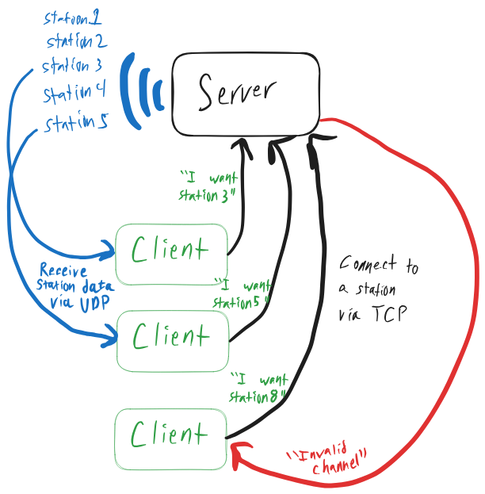

# Project3

**Goal:** Connect over UDP and actually stream the caption data to the clients.

**Estimated time to complete:** 10-15 hours

- **Note:** You can work with a group on this project! Groups will be assigned by me.

**Walkthrough using my solution:** [https://youtu.be/ImthGkKekos](https://youtu.be/ImthGkKekos)

# Overview

Project3 extends Project2. Let's refresh our memory on what we're trying to accomplish.

Our ultimate goal is to set up a server that behaves as a TV broadcast station. Of course, broadcasting TV is a bit too
complicated, so we'll be dealing with a heavily simplified version of the problem: our TV station will broadcast closed
caption (CC) text data.



In Project2, you set up a TCP server to handle connections from multiple clients. Project3 will involve actually
streaming the CC data (over UDP!).

# Project3 Instructions

As the template for the project, I've provideD you with the following:

- `server` and `client` projects, with `Cargo.toml` and ***some*** necessary dependencies
    - You are free to use additional dependencies as you see fit, but you'll have to find them yourself! (Google is your
      friend)
- `utils/src/lib.rs`: A spot to put code that you want both your server and client implementations to use
- `utils/tests`: integration tests. Run with `cargo test --package utils` to make sure that your implementations are
  adhering to the basic protocol spec
    - Your implementation should **pass all of the tests** in order to be eligible for full credit
    - Make sure to run these tests within the Docker environment, as described in Project0
    - Unlike in Project2, these tests don't cover everything! Your programs will be manually tested/inspected for
      protocol adherence
        - The reason the tests don't cover everything is that the style of test is very failure prone. I could "mock"
          server and client behavior for much more robust testing, but that would give away a lot of the work that
          you're expected to do!
- `youcookii_annotations_trainval.jsonl`: The dataset from which you will get your closed captions
- `reference_implementations/`: These are compiled binaries for my solutions. You can use them to test your own
  implementations. For example, start up my server, then try to interact with it through your client. Instructions for
  running these programs are in `reference_implementations/README.md`.

## Communication protocol

##### Server:

- The `server` `MUST` support an arbitrary number of connected `clients` simultaneously
- The `server` `MUST` have a fixed number of TV channels that continually broadcast, regardless of if any `client` is
  listening or not
    - The number of TV channels `MAY` be hard-coded, but `MUST` be more than 10
    - Each channel must be identified by a sequential number, starting at 0
        - I.e., if there are 10 channels, the channel numbers are 0-9, inclusive
- Each TV channel `MUST` read and broadcast `sentence` data from the provided
  file `youcookii_annotations_trainval.jsonl`
    - Each line of the file is a distinct `Clip`.
    - The `segment` portion of each `Clip` JSON is the start and end time of the `Clip`, in seconds. The `server` `MUST`
      keep a clock for each station, and broadcast each `sentence` at its correct start time.
    - The `server` `MAY` scale each clock by some fixed amount (e.g., 4x speed), for convenience in testing
    - When all the `sentence`s of a given clip have been broadcasted, the TV channel `MUST` begin broadcasting a
      new `Clip`
        - New `Clip`s `MAY` be chosen at random
- When the `server` receives a `Hello` TCP message from a client (described below), it `MUST` reply back with
  a `ChannelList` TCP message
    - The first octet of a `ChannelList` message is the `Command`, a `u8` decimal value of **0** in this case
    - Octets 2-3 consist are a `u16` value containing the number of TV channels that the `server` is broadcasting on
- When the `server` receives a `ChooseTvChannel` TCP message from a client (described below), it `MUST` reply back with
  one of the following TCP messages
    - An `InvalidChannel` message, where the `Command` is a `u8` of decimal value **1**
        - If the requested TV channel is out of range
    - A `Connected` message, where the `Command` is a `u8` of decimal value **2**
- When the `server` receives a valid `ChooseTvChannel` request, it `MUST` begin broadcasting that TV channel to
  the `client` via the UDP port it sent
    - Likewise, the `server` `MUST NOT` broadcast any other TV channel to that `client`. The most-recently requested TV
      channel `MUST` be the only one that the `client` receives.
- Each broadcasted message `MUST` be a UDP packet with the following `Data` segment
    - The first octet is the `ClipState`, either "Old" (decimal value **0**) or "New" (decimal value **1**), conveying
      if the TV channel's `Clip` has just begun
    - The second octet is the `DataSize` (`u8`), conveying how many bytes the following closed caption text data is
    - The remaining octets are the encoded text data

##### Client:

- If the `client` cannot connect to the given address over TCP, the `client` program `MUST` exit
- The `client` `MUST` initiate a connection to the server with a `Hello` message in the `data` portion of a TCP packet
    - The first octet of a `Hello` message is the `Command`, a `u8` decimal value of **33** in this case
    - Octets 2-3 consist are a `u16` value containing the UDP port that the client wants to communicate over
        - This UDP port `SHOULD` be allocated automatically by the operating system
- If the user enters an invalid TV channel number, the `client` `MUST` inform the user. The `client` `MUST NOT` send
  a `ChooseTvChannel` message containing the invalid channel number.
- If the `client` enters a valid TV channel number, the `client` `MUST` send a `ChooseTvChannel` message in the `data`
  portion of a TCP packet
    - The first octet of a `ChooseTvChannel` message is the `Command`, a `u8` decimal value of **34** in this case
    - Octets 2-3 consist are a `u16` value containing the station number
- Once the `client` has connected to a TV channel, it `MAY` stop listening for TCP messages. It also `MUST` indicate to
  the user that it has connected to the TV channel
- When the `client` receives a UDP message, it `MUST` print the IP address that it received the data from, followed by
  the CC data in text form
    - > The format should be like: `Received from 127.0.0.1:47020: add the bell peppers to the wok`
- If the `ClipState` of the UDP message is `New`, the `client` `MUST` print out a notification that a new clip has begun
- If the `client` disconnects from a TV channel, it `MUST` initiate a new TCP connection with the server

## Message types

To help elucidate the above protocol, here's a visualization of the different message types we can have.

#### Client -> Server (TCP)

```
************************************************************************
* bits 0-7: Command (u8) | bits 8-23: UDP port or station number (u16) *
************************************************************************
```

#### Server -> Client (TCP)

```
************************************************************************
* bits 0-7: Command (u8) | bits 8-23: - number of channels, if Command *
*                        |            is ChannelList (u16)             *
*                        |            - connected channel number, if   *
*                        |            Command is Connected (u16)       *
************************************************************************
```

#### Server -> Client (UDP)

```
************************************************************************
* bits 0-7: ClipState (u8) | bits 8-15: DataSize (u8)                  *
*----------------------------------------------------------------------*
* bits 16+: Closed caption text data                                   *
************************************************************************
```

## CLI protocol

#### Server:

- The `server` `MUST` accept an IP address and port as its first command line argument.
    - This `MUST` be the address that the TCP listener listens on.
- You `MAY` have no interactivity. You `MAY` simply start and stop the server manually.

#### Client:

- The `client` `MUST` accept an IP address and port as its first command line argument.
    - This `MUST` be the address that the `client` attempts to connect to.
- When not connected to a TV channel, the user `MUST` be able to enter to stdin the TV channel number to connect to.
- When not connected to a TV channel, the user `MUST` be able to enter to stdin the single character `"q"` to *exit the
  program*.
- When connected to a TV channel, the user `MUST` be able to enter to stdin the single character `"d"` to *disconnect
  from the TV channel*.
    - According to the above protocol, the `client` `MUST` then initiate a *new* TCP connection with the `server`.

## Tips

- You can add other dependencies for this project! Many libraries can help simplify your code base. Explore what's out
  there with Google or [crates.io](crates.io).
- Managing the communication between different threads/tasks can be made much simpler with [
  ***channels***](https://doc.rust-lang.org/rust-by-example/std_misc/channels.html). In Rust, channels are thread-safe,
  single-direction communication buffers.
    - In my solution, I called the TV channels "stations" to help distinguish the data names from these communication
      channels.
    - There are several excellent libraries for channels out there! Some are designed around asynchronous programming,
      while others are simpler. Find one that works well for you.
- You might find a compiler-enforced state machine pattern
  helpful: [State machine pattern](https://hoverbear.org/blog/rust-state-machine-pattern/)

## Student tips

Prior students of this course have added the following feedback, which may aid your debugging process.

- If you are having problems with the integration tests not fully killing everything listening on 8080, make sure you have lsof installed on your docker container that is running the tests. 
    - Install with `apt install lsof`
- If you have an error on Remote development on windows, try to update your RustRover and Docker. The update option is under help. Select Check for update.
    - If there is still an issue, try this command in admin PowerShell. Resetting HNS might help: `netsh int ip reset`
    - After that, restart your machine, and create a new dev container in your project remote development

# Submission

## Questions

- What's the difference between bind() and connect() for UDP?
- Why might we call bind(0.0.0.0:0)?
- According to the protocol, what is the maximum size of our UDP payload (in bytes)?
- Within the bounds of the protocol, what is a way that we can communicate *longer* `sentence`s within a single UDP
  packet? Under your proposed scheme, what is the maximum character length of a `sentence`?
- What will happen if one of the UDP messages is lost in transit?

## What to submit

- Push your working code to the main branch of your team's GitHub Repository before the deadline
- Edit the README to answer the above questions
- On Teams, *each* member of the group must individually upload answers to these questions:
    - What did you (as an individual) contribute to this project?
    - What did the other members of your team contribute?
    - Do you have any concerns about your own performance or that of your team members? Any comments will remain
      confidential, and Dr. Freeman will try to address them in a way that preserves anonymity.
    - After completing this project, what questions do you have about the material we've gone through so far?

## Rubric

Below is a prior rubric, although it is subject to change.

- All my tests pass (9 tests)	10%
- Manual testing works as expected	45%
- Code quality	25%
- Documentation quality	10%
- Readme questions (5 questions)	10%

Your individual grade will scale from here according to your participation level.